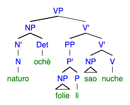

solely analytic (no morphology)

## Phonology and Orthography
```
m     n
p b   t d        k g
      ts    tʃ
f     s
      r l

ch = [tʃ]
z  = [ts]

a e i o u
```

(C)V

stress falls on the penult of the *word* unless otherwise indicated with a grave accent

## Examples
```
bolio    / store
folie    / house
naturo   / woman
gepo     / man
sao      / fish
kofo     / place
medikolo / doctor

li / in
zina / with
ne / of

sile / 3rd person

achè / (det) this
ochè / (det) that

kofo achè / here
kofo ochè / there

olo / to sell
Ø / COP
chepo / to exist
nuche / to eat
```

```
Gepo folie li chepo.
man house in exist
"There is (a) man in (the) house."
```



```
Naturo ochè folie li sao nuche.
woman that house in fish eat
"That woman eats fish in (the) house."
```

```
Gepo achè ne sile medikolo Ø.
man this of 3RD doctor COP
This man (husband) of theirs is (a) doctor.
```
